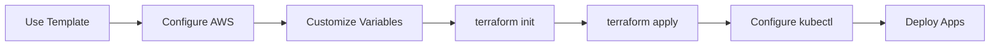

# Quick Start

Get your EKS cluster up and running in a few steps.



## Prerequisites

Before you begin, ensure you have the following tools installed:

| Tool | Version | Installation |
|------|---------|--------------|
| [Terraform](https://www.terraform.io/downloads) | >= 1.0 | `brew install terraform` |
| [AWS CLI](https://aws.amazon.com/cli/) | >= 2.0 | `brew install awscli` |
| [kubectl](https://kubernetes.io/docs/tasks/tools/) | >= 1.29 | `brew install kubectl` |
| [kustomize](https://kustomize.io/) | >= 5.0 | `brew install kustomize` |
| [pre-commit](https://pre-commit.com/) | >= 3.0 | `brew install pre-commit` |

## Step 1: Use This Template

Click **Use this template** on GitHub or clone directly:

```bash
git clone https://github.com/ops4life/eks-iac-template.git my-eks-project
cd my-eks-project
```

## Step 2: Configure AWS Credentials

```bash
aws configure
# or use environment variables
export AWS_ACCESS_KEY_ID="your-access-key"
export AWS_SECRET_ACCESS_KEY="your-secret-key"
export AWS_DEFAULT_REGION="ap-southeast-1"
```

## Step 3: Customize the Template

Search for `# TODO: Customize` comments and update:

```bash
# Update default region and project prefix
vim variables.tf

# Update environment-specific configurations
vim environments/dev/dev.tfvars
vim environments/qa/qa.tfvars
vim environments/prod/prod.tfvars
```

Key values to customize in `variables.tf`:

```hcl
variable "prefix" {
  default = "my-project"  # TODO: Customize - Change to your project name
}

variable "region" {
  default = "ap-southeast-1"  # TODO: Customize - Change to your region
}
```

## Step 4: Install Pre-commit Hooks

```bash
pre-commit install
```

## Step 5: Initialize Terraform

```bash
terraform init
```

## Step 6: Deploy EKS

```bash
# Preview changes
terraform plan -var-file=environments/dev/dev.tfvars

# Apply infrastructure
terraform apply -var-file=environments/dev/dev.tfvars
```

## Step 7: Configure kubectl

```bash
aws eks --region <region> update-kubeconfig --name <prefix>-dev-cluster
kubectl get nodes
```

## Step 8: Deploy an Application

```bash
# Preview Kubernetes manifests
kustomize build k8s/apps/nginx/overlays/dev/

# Deploy nginx example application
kubectl apply -k k8s/apps/nginx/overlays/dev/

# Verify deployment
kubectl get all -n dev -l app=nginx
```

## GitHub Actions Setup

To use the CI/CD workflows, add the following secrets to your GitHub repository:

| Secret | Description | Required |
|--------|-------------|----------|
| `AWS_ACCESS_KEY_ID` | AWS access key | Yes |
| `AWS_SECRET_ACCESS_KEY` | AWS secret key | Yes |
| `AWS_REGION` | AWS region | Yes |
| `INFRACOST_API_KEY` | Infracost API key | No |
| `GITLEAKS_LICENSE` | Gitleaks license | No |
| `WORKFLOW_TOKEN` | GitHub token for auto-commits | No |

!!! tip "GitHub OIDC"
    For production use, consider replacing static AWS credentials with GitHub OIDC for keyless authentication.

## Next Steps

- Read the [Usage Guide](usage.md) for detailed configuration options
- Explore the [Workflows](../user-guide/workflows.md) documentation
- Review the [Configuration Reference](../reference/configuration.md)
