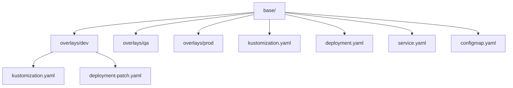

# Usage Guide

Detailed instructions for using and customizing this EKS infrastructure template.

## Environment Management

This template supports three environments with separate Terraform variable files:

=== "Dev"

    ```hcl
    # environments/dev/dev.tfvars
    env    = "dev"
    prefix = "my-project"
    region = "ap-southeast-1"

    # Cost-optimized: 2 AZs, SPOT only, single NAT
    availability_zones_count = 2
    single_nat_gateway       = true

    node_groups = {
      spot = {
        capacity_type  = "SPOT"
        instance_types = ["t3.medium", "t3a.medium"]
        min_size       = 1
        max_size       = 3
        desired_size   = 2
      }
    }
    ```

=== "QA"

    ```hcl
    # environments/qa/qa.tfvars
    env    = "qa"
    prefix = "my-project"
    region = "ap-southeast-1"

    # 3 AZs, mixed SPOT/ON_DEMAND, single NAT
    availability_zones_count = 3
    single_nat_gateway       = true

    node_groups = {
      spot = {
        capacity_type  = "SPOT"
        instance_types = ["t3.medium"]
        min_size       = 1
        max_size       = 3
        desired_size   = 2
      }
      on_demand = {
        capacity_type  = "ON_DEMAND"
        instance_types = ["t3.medium"]
        min_size       = 1
        max_size       = 2
        desired_size   = 1
      }
    }
    ```

=== "Prod"

    ```hcl
    # environments/prod/prod.tfvars
    env    = "prod"
    prefix = "my-project"
    region = "ap-southeast-1"

    # 3 AZs, NAT per AZ, higher node counts
    availability_zones_count = 3
    single_nat_gateway       = false

    node_groups = {
      spot = {
        capacity_type  = "SPOT"
        instance_types = ["t3.medium"]
        min_size       = 2
        max_size       = 5
        desired_size   = 3
      }
      on_demand = {
        capacity_type  = "ON_DEMAND"
        instance_types = ["t3.medium"]
        min_size       = 2
        max_size       = 4
        desired_size   = 2
      }
    }
    ```

## Terraform Operations

### Common Commands

```bash
# Format all Terraform files
terraform fmt -recursive

# Validate configuration
terraform validate

# Plan for specific environment
terraform plan -var-file=environments/dev/dev.tfvars

# Apply for specific environment
terraform apply -var-file=environments/dev/dev.tfvars

# Destroy infrastructure
terraform destroy -var-file=environments/dev/dev.tfvars
```

### Remote State Backend

The template defaults to local state. For team use, enable S3 backend in `versions.tf`:

```hcl
# Uncomment and configure in versions.tf
terraform {
  backend "s3" {
    bucket         = "my-terraform-state"
    key            = "eks/terraform.tfstate"
    region         = "ap-southeast-1"
    encrypt        = true
    dynamodb_table = "terraform-state-lock"
  }
}
```

## Kubernetes Application Management

### Kustomize Structure



```
k8s/apps/{app-name}/
├── base/              # Shared configuration
│   ├── kustomization.yaml
│   ├── deployment.yaml
│   ├── service.yaml
│   └── configmap.yaml
└── overlays/          # Environment-specific overrides
    ├── dev/
    │   ├── kustomization.yaml
    │   └── deployment-patch.yaml
    ├── qa/
    └── prod/
```

### Adding a New Application

1. Create the base manifests:

    ```bash
    mkdir -p k8s/apps/myapp/base
    mkdir -p k8s/apps/myapp/overlays/{dev,qa,prod}
    ```

2. Create `k8s/apps/myapp/base/kustomization.yaml`:

    ```yaml
    apiVersion: kustomize.config.k8s.io/v1beta1
    kind: Kustomization
    resources:
      - namespace.yaml
      - deployment.yaml
      - service.yaml
    commonLabels:
      app: myapp
    ```

3. Add overlays for each environment with patches

4. Deploy:

    ```bash
    kustomize build k8s/apps/myapp/overlays/dev/
    kubectl apply -k k8s/apps/myapp/overlays/dev/
    ```

5. Add the app to `.github/workflows/deploy-k8s-app.yml` workflow choices

## Linting and Security

```bash
# Run all pre-commit hooks
pre-commit run --all-files

# Run TFLint
tflint --init && tflint --config=.tflint.hcl

# Run Checkov security scan
checkov --config-file .checkov.yml
```

## Troubleshooting

### kubectl Cannot Connect to Cluster

```bash
# Update kubeconfig
aws eks --region <region> update-kubeconfig --name <prefix>-<env>-cluster

# Verify
kubectl cluster-info
kubectl get nodes
```

### Terraform State Lock

```bash
# Force unlock (use with caution)
terraform force-unlock <lock-id>
```

### Node Group Not Scaling

Check the cluster autoscaler logs and IAM permissions for the node role.
