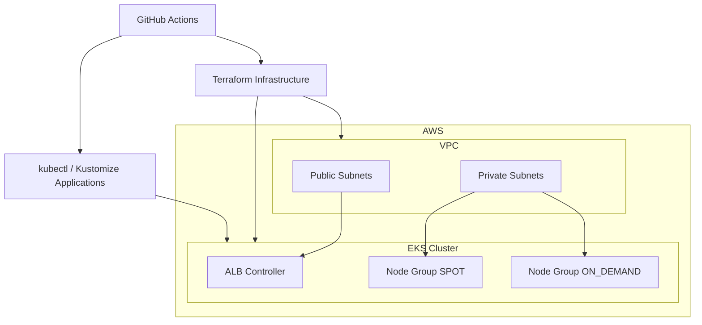

# EKS Infrastructure Template

Production-ready EKS infrastructure template with Terraform, Kustomize, and CI/CD pipelines.

## Overview

This template provides a complete foundation for deploying and managing Amazon EKS clusters on AWS. It includes:

- **Infrastructure as Code** with Terraform modules for VPC and EKS
- **Multi-environment support** for dev, qa, and prod
- **Kubernetes application management** with Kustomize overlays
- **Automated CI/CD pipelines** via GitHub Actions
- **Security scanning** with Checkov and Gitleaks
- **Cost estimation** with Infracost
- **Automated documentation** generation

## Architecture

## Key Features

| Feature | Description |
|---------|-------------|
| EKS Cluster | Managed Kubernetes with configurable node groups |
| VPC | Custom VPC with public/private subnets across multiple AZs |
| ALB Controller | AWS Load Balancer Controller for Ingress resources |
| Multi-env | Separate configurations for dev, qa, and prod |
| SPOT + ON_DEMAND | Mixed node group strategy for cost optimization |
| CI/CD | 9 pre-configured GitHub Actions workflows |
| Security | Checkov, Gitleaks, and TFLint scanning |
| Cost Tracking | Infracost integration on pull requests |

## Quick Navigation

| Guide | Description |
|-------|-------------|
| [Quick Start](getting-started/quick-start.md) | Get your EKS cluster up and running in minutes |
| [Usage Guide](getting-started/usage.md) | Detailed instructions for using this template |
| [Contributing](user-guide/contributing.md) | How to contribute to this project |
| [Configuration Reference](reference/configuration.md) | Complete configuration reference |
